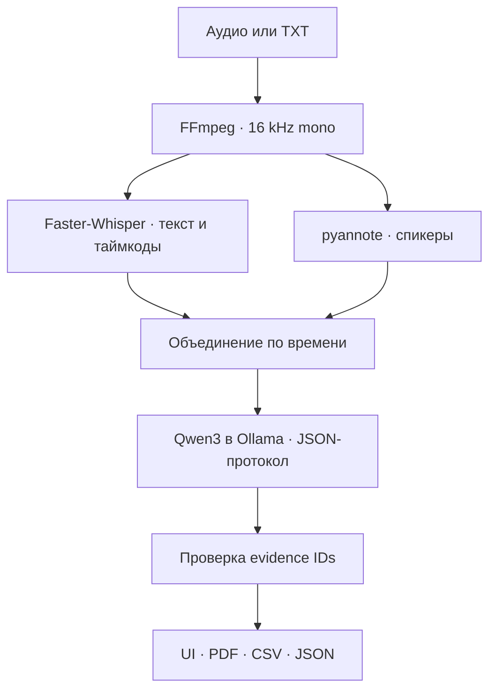

# AI Meeting Intelligence

Локальный ИИ-протоколист совещаний: принимает MP3, WAV, M4A или готовый TXT,
разделяет речь по спикерам, создаёт проверяемый протокол и экспортирует результат
в JSON, CSV и PDF. Во время обработки данные не отправляются во внешние API.

## Что уже есть в репозитории

- локальная транскрибация через `faster-whisper`;
- локальная диаризация через `pyannote Community-1`;
- привязка каждого слова к спикеру с очисткой коротких ошибочных переключений;
- структурированный анализ через `Qwen3` в локальном `Ollama`;
- выбор языка итогового отчёта: русский, казахский, английский или автоматически;
- защита от неподтверждённых выводов: каждый факт содержит ID исходных реплик;
- Executive Summary, ключевые факты, темы, решения, вопросы, поручения и риски;
- локальный веб-интерфейс без CDN и внешних шрифтов;
- экспорт JSON, CSV и PDF;
- фоновая обработка и индикатор прогресса;
- тесты основной логики.

## Архитектура



Подробности находятся в [docs/ARCHITECTURE.md](docs/ARCHITECTURE.md).

## Рекомендуемая конфигурация

Для ноутбука с 16 ГБ RAM и NVIDIA GPU 8 ГБ:

- Whisper: `large-v3`, `float16` или `int8_float16`;
- Qwen: `qwen3:8b`;
- модели запускаются последовательно, чтобы не держать всё в VRAM одновременно.

Если памяти не хватает, используйте Whisper `small` и `qwen3:4b`.

## Быстрый запуск

Нужны Python 3.11+, FFmpeg и Ollama.

```bash
python -m venv .venv
source .venv/bin/activate
python -m pip install -r requirements/ai.txt
cp .env.example .env
```

Затем подготовьте модели при включённом интернете:

```bash
export HF_TOKEN="ваш_бесплатный_Hugging_Face_токен"
python scripts/download_models.py --whisper large-v3 --diarization --ollama qwen3:8b
```

Скрипт всегда сохраняет модели в папку `models` внутри проекта, даже если он был
вызван из другой рабочей папки.

Для `pyannote Community-1` сначала примите условия модели на Hugging Face.
Токен нужен только для скачивания и не сохраняется приложением.

Запуск приложения:

```bash
./scripts/run_offline.sh
```

Откройте <http://127.0.0.1:8000>.

### Запуск в Windows PowerShell

```powershell
py -3.12 -m venv .venv
.\.venv\Scripts\python.exe -m pip install -r requirements\ai.txt
Copy-Item .env.example .env
powershell -ExecutionPolicy Bypass -File .\scripts\run_offline.ps1
```

Перед обработкой аудио модели нужно один раз скачать по инструкции выше. Для
наиболее точной диаризации укажите в форме реальное количество людей, которые
говорят в записи. Если на встрече присутствовали пять человек, но говорил только
четыре, укажите `4`.

## Работа без интернета

После скачивания моделей приложение использует только:

- локальные файлы модели Whisper;
- локальную папку модели pyannote;
- Ollama на `127.0.0.1`;
- локальное хранилище `data/`.

`scripts/run_offline.sh` включает offline-флаги Hugging Face и Transformers.
Для демонстрации отключите Wi-Fi до загрузки тестового файла.

Проверка окружения:

```bash
python scripts/verify_offline.py
```

## API

После запуска документация доступна на <http://127.0.0.1:8000/docs>.

Основные маршруты:

- `POST /api/v1/meetings` — загрузить запись или транскрипт;
- `GET /api/v1/jobs/{job_id}` — получить прогресс;
- `GET /api/v1/meetings/{meeting_id}` — открыть протокол;
- `GET /api/v1/meetings/{meeting_id}/export/{json|csv|pdf}` — скачать отчёт;
- `GET /api/health` — проверить локальные компоненты.

## Разработка и тесты

```bash
python -m pip install -r requirements/dev.txt
python -m pytest
ruff check app tests scripts
```

Пример транскрипта: [samples/demo_transcript.txt](samples/demo_transcript.txt).

## Ограничения MVP

- имена людей не определяются по голосовой биометрии: после диаризации используются
  `Speaker 1`, `Speaker 2`; в TXT можно сразу указывать имена перед двоеточием;
- точность диаризации зависит от микрофона, шума, эха и одновременной речи;
- одновременная речь и шум могут снизить качество разделения спикеров;
- текущий анализ выполняется одним проходом и рассчитан на транскрипт до значения
  `MAX_TRANSCRIPT_CHARS`;
- факты проверяются по существованию ссылок на реплики, но смысловая правильность
  всё равно должна подтверждаться человеком.

## Лицензия

Код проекта распространяется по MIT License. Лицензии весов моделей сохраняются
отдельно: Qwen3 — Apache 2.0, pyannote Community-1 — CC BY 4.0, Whisper — MIT.
